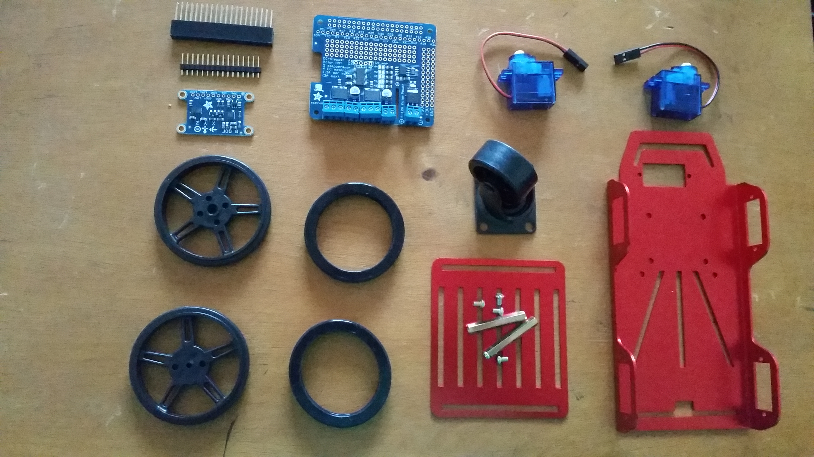
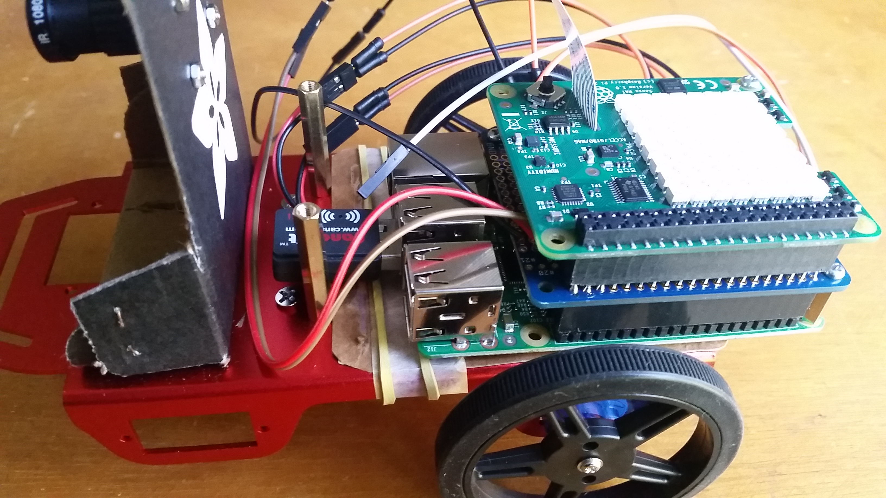

# Cabot - Part 1
## Design and Implementation of Autonomous Vehicle System – Part 1

What is an Autonomous Vehicle System?

Based on Wikipedia, an autonomous vehicle is a vehicle that is capable of sensing its environment and navigating without human input.

Using sensors like radar, lidar, GPS, odometry and computer vision, autonomous aerial and non-aerial vehicles can detect and analyze the environment for navigation and data collection.

Currently I am enrolled in a project where the target is, at final, implement some basic autonomous features to a robot vehicle. So, I decided to share this journey, allowing access to the project’s content. This is an ongoing project and so, I will update this blog and the repository from time to time while the project is in progress.
My goal is the design and development of software system or, in other words, the algorithms used to implement applications involved in both discrete actions and continuous motions. So, I will not go into details about the hardware used (it is very simple) but I will point some resources where you can get more details.
So, let me describe what you will find here in the next weeks.

## Summary of Project Content

To facilitate the design, implementation and tests, the software language will be primarily Python but I will try to provide a C/C++ version when possible (and if I have time) for better performance. In addition, in some cases I will also provide the Matlab source code that is a good platform for simulation.

That said, as I mentioned above, the basic autonomous that I will be working on are listed as follow:

- Tracking
  - Path planning (Dijkstra’s algorithm). Implementation in Python for easy test and C/C++ for better performance.
  - Controls
  - Estimation (Extended Kalman Filter – EKF)
- Calibration
  - Calibrate sensors
  - Calibrate the robot
- Control
  - Design and implement a controller
  - Apply to poses
  - Follow AprilTag markers
  - Implement EKF to manage AprilTag
  - Process measurements values from IMU
- Putting all together

Moving the robot autonomously

## Choosing the hardware

Basically, I am using:
- Raspberry Pi 2 (but Pi 3 has better performance)
- Sense HAT (but you can use any other IMU)
- Pi camera
- 2 DC motors
- Stepper motor HAT
- Batteries

To help on the hardware list, here you have 2 suggestions.
The first, you will find here from Adafruit.
The second, you will find here from Sparkfun where you will need to replace Arduino by Raspberry Pi 2 or 3.
In both suggestions you will need to add a Pi camera, an IMU and stepper motor HAT.

Here is a picture of my hardware kit.

The hardware list

In Adafruit website you will find figures and videos showing how to assembly the hardware.

Here is a picture of my assembled robot.

- Final assembled kit
One suggestion about the hardware is try to use a different power source for the motors and for raspberry pi. The motors use to dry a good current value and if you use the same power source for both raspberry pi and the motors, this might make raspberry to became unstable, causing malfunction, which means that your computer becomes not reliable. Or use a robust battery that can support the entire system.

Getting the software
In this project I am using Raspbian Jessie version 4.4 that you can download from here.
The software for vehicle control is ROS Indigo that you can download from here.

Software Installation

Installing the Raspbian OS is an easy operation. You will need make use of a micro SD card that you will burn with the Pi OS. You can find the installation process guide here.
I attached a HDMI monitor to my Pi, to do my initial Raspberry Pi setup. After that, I have used SSH to connect to Raspberry Pi.

You will find the installation guide of ROS Indigo on Raspberry Pi here.
Basically the steps are:

1.       Setup ROS repositories
2.       Create catkin workspace
3.       Resolve dependencies
4.       Build the catkin workspace

After configure the environment, I added the VNC server to allow me to use GUI interface only when necessary. For instance, to run the PyCharm package to load and run some Python projects. You will find the instructions for VNC server installation here.

Testing the robot movement

In this video you can see the progress of this project. Note that for now, I have only provided basic functionalities just to test if the driver and motors are working properly.

For the next Part 2, I will be work on motor, camera and IMU calibrations.
Stay tuned…

Design and Implement an Autonomous Vehicle System
You will find the complete documentation in my blog at http://kinect-i.blogspot.com.br/2016/07/design-and-implementation-of-autonomous.html
Note that the project was splitted in parts.
